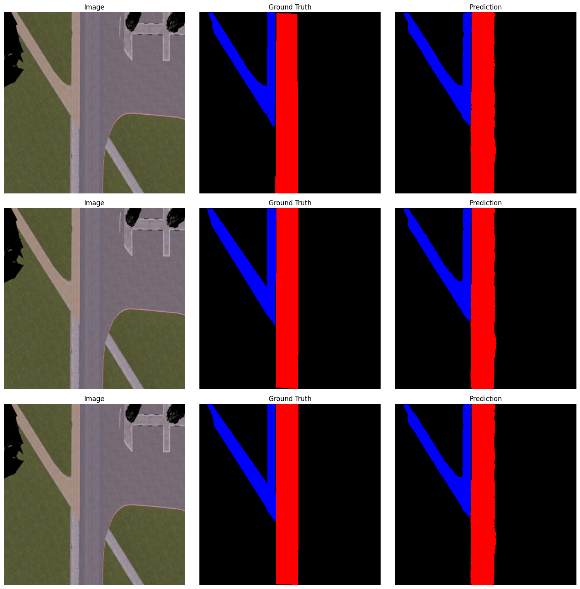

# Baylands Path Segmentation

Trained a **U-Net (MobileNetV2 encoder, pretrained on ImageNet)** for multi-class segmentation. This project performs **semantic segmentation of drone camera frames** in the Baylands Gazebo world. The dataset was collected using **PX4-Autopilot x500_mono_cam_down camera**, published via **ROS 2 Humble** with **rosgzbridge**. Classes: background, path, road.

The dataset used in this project was **annotated and downloaded from Roboflow** (Project ID: `baylands_path_segmentation-lknc3`). Using this dataset, the model was trained in **Google Colab** for segmentation tasks.  

[](https://universe.roboflow.com/drone-path-planning/baylands_path_segmentation-lknc3)

This repository contains a **complete standalone Colab notebook** for multi-class image segmentation of drone images using a U-Net model with a MobileNetV2 encoder. It includes the dataset, training, validation, and visualization steps. The notebook is designed to work with Google Drive.

---

## Repository Structure

```

drone\_segmentation/
│
├─ drone\_segmentation.ipynb      # Complete Colab notebook
├─ segmentation\_dataset/         # Dataset (train/valid/test folders, downloaded from Roboflow)
└─ README.md                     # This file

```

---

## Dataset

The dataset is organized as follows:

```

segmentation\_dataset/
├─ train/
│  ├─ image1.jpg
│  ├─ image1\_mask.png
│  └─ ...
├─ valid/
│  ├─ image1.jpg
│  ├─ image1\_mask.png
│  └─ ...
├─ test/
│  ├─ image1.jpg
│  ├─ image1\_mask.png
│  └─ ...

````

- Each image has a corresponding mask with `_mask.png` suffix.
- Classes:
  - `0` = Background
  - `1` = Path
  - `2` = Road

> **Note:** The dataset was annotated and downloaded from Roboflow ([Project Link](https://universe.roboflow.com/drone-path-planning/baylands_path_segmentation-lknc3)). If the dataset is too large for GitHub, it can be hosted externally and downloaded in the notebook automatically.

---

## How to Run

1. Open `drone_segmentation.ipynb` in **Google Colab**.
2. Mount your Google Drive:

```python
from google.colab import drive
drive.mount('/content/drive')
````

3. Ensure the dataset path is correct:

```python
BASE_DIR = "/content/drive/MyDrive/segmentation_dataset"
```

4. Install dependencies (already included in the notebook):

```python
!pip install torch torchvision
!pip install albumentations
!pip install segmentation-models-pytorch --extra-index-url https://download.pytorch.org/whl/cpu
!pip install matplotlib
```

5. Run all notebook cells:

   * Data loading and verification
   * Model training
   * Validation
   * Visualization of predictions

---

## Trained Model

The trained U-Net model is available in this repository as `best_segmentation_model.pth` (\~25.5 MB).
You can load it in PyTorch with:

```python
import torch
model.load_state_dict(torch.load("best_segmentation_model.pth"))
model.eval()
```

---

## Example Predictions



---

## Features

* Multi-class segmentation with **U-Net** and **MobileNetV2** encoder.
* Data augmentation using **Albumentations**.
* Train/Validation split support.
* Dice score metric for multi-class evaluation.
* Save best model automatically.
* Visualization of predictions vs ground truth.

---

## Dependencies

* Python 3.8+
* PyTorch
* Albumentations
* segmentation-models-pytorch
* OpenCV
* Matplotlib
* Numpy

---

## Notes

* The notebook is **standalone** and designed to run entirely in Google Colab.
* You can modify batch size, image dimensions, and number of epochs directly in the notebook.
* Make sure your Google Drive has enough space to store the dataset and trained model.

---

## License

This project is open-source and free to use. Please cite if you use this work in research.
